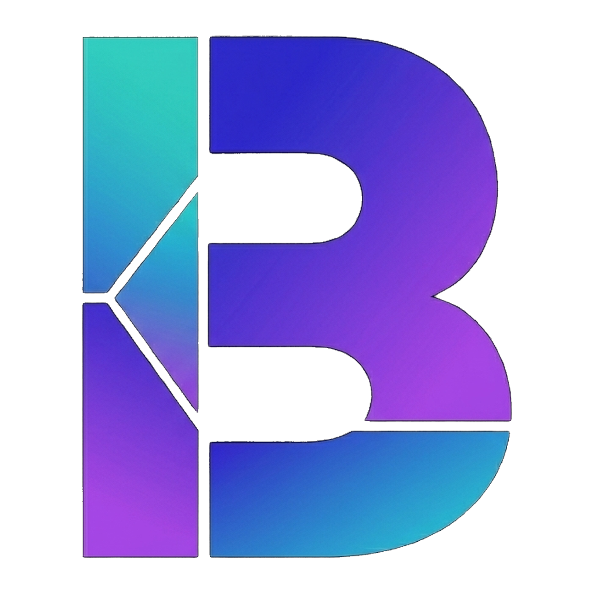

# Byte Design Studio

**AI-assisted design, right on your Mac.**

Describe what you want. Watch it build. Tweak, branch, and ship without touching a text editor.

[Download the latest release →](https://github.com/gibels-and-bits/byte-design-studio-releases/releases/latest)

---

## What is it?

Byte Design Studio is a native macOS app that turns plain-English prompts into working React prototypes. It wraps Claude and a live Vite preview in a single window so you can go from "what if the order card had a warning ring when it's almost late?" to a rendered, interactive prototype — without opening a terminal or editor.

It's built for the design → code handoff: iterate visually, branch into variants, keep a single source-of-truth design system, and export production-ready code when you're ready.

## Install

1. Download **Byte Design Studio.dmg** from the [latest release](https://github.com/gibels-and-bits/byte-design-studio-releases/releases/latest).
2. Open the DMG, drag the app into **Applications**.
3. First launch: right-click → **Open** (the app is signed ad-hoc, so Gatekeeper will ask once).
4. That's it. Updates auto-check on launch — when a new version ships, you'll see a banner.

### Before you can create projects

The setup wizard runs on first launch and walks you through three required tools. You can install them from inside the app with one click:

| Tool | Why | Auto-install? |
|------|-----|---------------|
| **Git** | Version control for variants and undo | Yes, via Xcode Command Line Tools |
| **Node.js** | Runs the live preview server | Manual — link opens nodejs.org |
| **Claude Code** | The AI engine | Yes, via `npm install -g @anthropic-ai/claude-code` |
| *Cloudflare Tunnel* (optional) | Share a live prototype URL with teammates | Yes, via Homebrew |

The wizard shows a green check when each one is ready. Click **Get Started** and you're in.

---

## Your first project

From the home screen:

1. Click **New Design** — name it whatever you're designing ("Kitchen Display", "Loyalty Onboarding"). The name turns into a folder under `~/Design Studio/`.
2. The app scaffolds a fresh **React + Vite + Tailwind** project, installs dependencies, and opens the workspace. Progress shows as it goes.
3. Within a few seconds the canvas appears with a blank white frame and a chat panel on the right.

> **Tip:** If your team has a shared repo, paste its Git URL during project creation. Your project will be committed to a subdirectory of that repo, and teammates can open it the same way.

**Already have a project?** Click **Open Existing…** and point at any folder. The app treats it as a standard Vite project.

---

## The workspace at a glance

| Region | What it does |
|--------|--------------|
| **Canvas (center)** | Live preview of your React app inside a device-sized frame |
| **Chat (right)** | Where you talk to Claude |
| **Sidebar (left)** | Variants, logs, project settings |
| **Bottom bar** | Zoom controls, device preset picker |
| **Tabs (top)** | Switch between Canvas and Design System views |

### Canvas: zoom, pan, frame it

- **Zoom** — Ctrl+Scroll, or use the +/− in the bottom bar (10% – 200%)
- **Pan** — press **H** for hand mode and drag; press **V** to go back to pointer mode
- **Fit to window** — ⌘0 snaps the frame back into view
- **Switch device** — pick **Phone** (390×844), **Web** (1440×900), or **Elo Tablet** (1920×1080) from the bottom bar. The frame resizes and re-centers.

### Live preview

The preview is a real Vite dev server — the same one you'd run in your terminal — embedded in the canvas. When Claude finishes an edit, the canvas reloads automatically. When you (or Claude) edit a file in `src/`, the dev server picks it up via file watching and repaints within a second or two.

---

## Talking to Claude

The chat panel is where everything happens. Type what you want, press **⌘Enter**, and watch.

### Direct mode vs. Plan mode

The chat has two generation modes:

**Direct** (default) — best for surgical changes.
> "Make the header background `#0e2a47`."
> "Add a subtle red pulse animation to overdue orders."
> "Double the padding on the card."

Claude reads, writes, and shows you the result. One round trip.

**Plan** — best for larger changes where you want Claude to think first.
> "Redesign the expo screen so the most urgent orders float to the top and finished ones grey out."

Plan mode asks you **3–6 clarifying questions one at a time**, each with suggested answers you can click ("A — sort by urgency", "B — stack by station"). Answer them and Claude builds with the full brief in hand. The result tends to match what you actually wanted the first time.

The app **auto-suggests Plan mode** when it notices a complex ask (long prompts, words like "redesign" / "rework" / "rebuild"). You'll see a lightbulb toast under the input — tap it to opt in.

### Attach reference images

Drag an image onto the chat input, paste with ⌘V, or click the paperclip icon. Great for:

- A Figma export you want replicated
- A screenshot from another app you want to echo
- A sketch of a layout

Claude reads the image and matches it — including using exact color values from your design system if they overlap.

Images are saved into your project under `.design-studio/references/` so you can re-attach them later from a menu without hunting through Finder.

### Pick an element to change

Click the **Select Element** button in the frame toolbar (or hit the crosshair icon). Hover over the preview — DOM elements highlight blue. Click one.

The selected element — its component name, file, line number, and a screenshot — becomes context for your next prompt. Now you can say "make this rounder" and Claude knows exactly which component you mean.

The selected element appears as a pill above the chat input. Hit the **×** to clear it, or just send your message (it clears automatically after sending).

### Keyboard shortcuts worth knowing

| Shortcut | Does |
|----------|------|
| **⌘Enter** | Send message |
| **V** | Pointer mode (click-through to preview) |
| **H** | Pan mode (drag the canvas) |
| **⌘0** | Fit frame to window |
| **⌘.** | Toggle chat panel |
| **Ctrl + Scroll** | Zoom |

---

## The design system

Hit the **Design System** tab (top of workspace) to manage your visual language.

### DESIGN.md is your source of truth

Byte treats a **single markdown file** — `DESIGN.md` — as the authoritative design system. One file, human-readable, version-controlled, and directly usable by the AI. No JSON, no proprietary formats, no drift between Figma and code.

A DESIGN.md is structured into well-known sections:

- **Visual Theme & Atmosphere** — mood, inspirations
- **Color Palette & Roles** — `Primary (#3b82f6): CTA buttons, active states`
- **Typography Rules** — families + scale table
- **Component Stylings** — buttons, cards, inputs
- **Layout Principles** — grid, max widths, spacing scale
- **Depth & Elevation** — shadows, focus rings
- **Do's and Don'ts** — guardrails
- **Responsive Behavior** — breakpoints
- **Agent Prompt Guide** — free-form notes for the AI

Sections can be skipped or renamed slightly (the parser is forgiving). You can start from a template, import an existing `.md`, or pick one from your library.

### Edit in markdown, preview in pixels

The editor is split: markdown on the left, live token previews on the right. Colors show as swatches, typography as rendered samples, spacing as scaled blocks, elevation as actual shadows.

Hit **Apply** and two things happen:

1. Tokens compile to `src/design-tokens.ts` — your React code consumes them as CSS custom properties (`var(--color-primary)`).
2. The full DESIGN.md is folded into `CLAUDE.md` with a strict instruction to Claude: *"Never introduce colors, fonts, or spacing that aren't in this file."*

Result: every component the AI generates obeys your design language. No surprise "Tailwind blue" where you specified a hex.

### Import from the tools you already use

The importer accepts:

- **Figma Tokens** (Tokens Studio JSON)
- **Style Dictionary**
- **Tailwind config**
- **CSS custom properties** (`:root { --color-primary: #3b82f6 }`)
- **Raw JSON**

Paste or pick a file — the app extracts what it can and merges it into your DESIGN.md.

### Global library: reuse across projects

Found a system you like? Click **Save to Library**. It's persisted to your user Library folder with a set of preview swatches so you recognize it later. On your next project, click **Library** to apply it with one click.

---

## Variants: safe "what if"s

Variants are git branches under a friendlier name. Use them when you want to try a bold idea without messing up what's working.

From the sidebar:

1. Click **+** next to **Variants**, name it ("Dark Mode", "Mobile Pass", "Investor Demo").
2. The branch is created and checked out automatically.
3. Chat with Claude like normal — changes happen on the variant branch only.

Right-click a variant for:

- **Compare to Main** — side-by-side diff of what's different
- **Promote to Main** — merge this variant forward; main is preserved in your timeline
- **Discard** — delete the branch

Switching variants reloads the preview. Each branch has its own chat history and version timeline, so you can jump between explorations cleanly.

---

## Tips that will save you time

- **Be specific about where.** "Make the button blue" is vague. Selecting the button first and saying "make this blue" is a one-shot. Saying "the green save button in the modal" is also fine — Claude is good at finding things by description.
- **Use plan mode when your ask has more than one moving part.** It's faster overall because you don't re-prompt as much.
- **Put constraints in DESIGN.md.** If every button should be `rounded-lg` and every shadow should be `--shadow-sm`, encode it once. Claude will never drift.
- **Branch before you wreck.** A variant is cheaper than an undo. If you're about to try something speculative, create one first.
- **Attach a reference for visual asks.** A screenshot gets you 80% of the way there in one turn.

---

## When things go wrong

**The preview won't load.** Check that the dependencies install step finished (bottom bar shows status). If the Vite server crashed, switching device presets re-starts it. As a last resort, close and reopen the project.

**The AI seems stuck.** The chat shows live tool progress — Reading, Writing, Installing. If it's been spinning for a minute with no movement, cancel with the stop button and try a shorter, more specific prompt.

**Updates aren't showing.** On launch the app checks this repo for a newer version. If it's silent, confirm you're on the network; pressing **⌘R** on the home screen re-runs the check.

**Something's really broken.** Click **Logs** at the bottom of the sidebar. Grab the latest `.log` file and send it to the team lead — crash handlers capture uncaught exceptions and signals with full stack traces.

---

## Staying up to date

The app checks for updates on every launch. When a new DMG lands here, a banner appears at the top of the home screen with a **Download** button. You don't need to check manually.

## Getting help

- Stuck on a feature? Ping the design studio channel.
- Found a bug? Send the log file (sidebar → Logs) to the team lead.
- Got ideas? Write them down — this tool evolves fast and your feedback shapes it.

---

*Built for designers who want to move faster than a handoff.*

