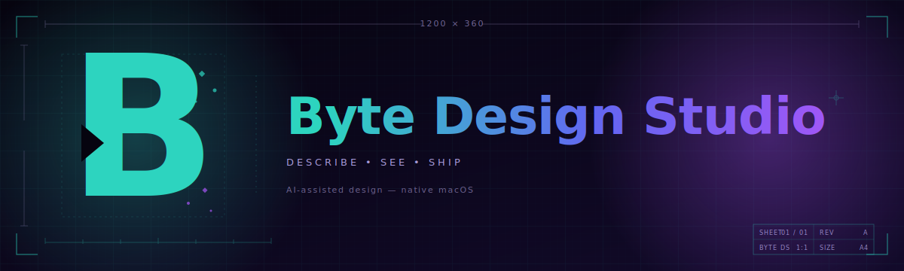

 

 

### AI-assisted design on macOS. Prompt it. Preview it. Ship it.

Describe what you want, watch it build, branch your ideas, and hand off production-ready React — without leaving one window.

 

### [⬇︎ Download the latest DMG](https://github.com/gibels-and-bits/byte-design-studio-releases/releases/latest)

---

## Why Byte?

<table>
<tr>
<td width="33%" valign="top">

### Describe
Type in plain English. No widgets, no sidebars full of sliders — just a chat that understands what you mean.

</td>
<td width="33%" valign="top">

### See
A real Vite dev server runs behind the canvas. Every change is a live render, not a mockup.

</td>
<td width="33%" valign="top">

### Ship
The output is real React. Commit it, merge it, hand it off. No export step, no hidden format.

</td>
</tr>
</table>

---

## Install

1. Grab **Byte Design Studio.dmg** from the [latest release](https://github.com/gibels-and-bits/byte-design-studio-releases/releases/latest).
2. Open it, drag the app into **Applications**.
3. First launch: right-click the app &rarr; **Open** (signed ad-hoc, so Gatekeeper asks once).

> [!NOTE]
> Updates auto-check on launch. When a new DMG lands here, a banner appears at the top of the home screen with a one-click download. You don't have to babysit this page.

### Prerequisites (handled by the setup wizard)

The first-run wizard walks you through three required tools with one-click install where possible:

| Tool | Why | Install |
|------|-----|---------|
| **Git** | Variants, undo, version control | Auto &middot; Xcode CLT |
| **Node.js** | Runs the live preview server | Manual &middot; [nodejs.org](https://nodejs.org) |
| **Claude Code** | The AI engine | Auto &middot; `npm i -g @anthropic-ai/claude-code` |
| *Cloudflare Tunnel* (optional) | Share a live prototype over the internet | Auto &middot; Homebrew |

Green checks across the board &rarr; **Get Started** &rarr; you're in.

---

## Your first project

1. **New Design** on the home screen. Name it what you're designing.
2. The app scaffolds a fresh **React + Vite + Tailwind** project under `~/Design Studio/`, installs dependencies, and opens the workspace.
3. The canvas appears with a blank frame. The chat is on the right. Type.

> [!TIP]
> Already have a project? Click **Open Existing&#8230;** and point at any folder with a `package.json`. Byte treats it as a standard Vite project.

---

## The workspace

A single window. Canvas in the middle, chat on the right, sidebar on the left. Two top tabs: **Design** (the canvas) and **Design System** (your tokens).

### Canvas &middot; zoom, pan, frame it

- **Zoom** &middot; Ctrl + Scroll, or use **+/&minus;** in the bottom bar (10% &ndash; 200%)
- **Pan** &middot; press **H** to hand-drag the canvas, **V** for pointer
- **Fit** &middot; **&#8984;0** snaps the frame back into view
- **Device** &middot; **Phone** (390&times;844), **Web** (1440&times;900), or **Elo Tablet** (1920&times;1080)

### Live preview
The preview is a real Vite dev server embedded in the canvas. Claude edits a file &rarr; preview reloads. You edit a file &rarr; preview reloads. No manual refresh.

---

## Talking to Claude

The chat is where everything happens. Type, hit **&#8984;Enter**, watch.

### Two modes, picked automatically

<table>
<tr>
<td width="50%" valign="top">

#### Direct
**Best for:** small, surgical changes.

*"Make the header `#0e2a47`."*
*"Add a red pulse to overdue orders."*
*"Double the padding on the card."*

One round trip. Claude reads, writes, you see the change.

</td>
<td width="50%" valign="top">

#### Plan
**Best for:** multi-part asks, redesigns, anything ambiguous.

*"Redesign the expo screen so urgent orders float to the top and finished ones grey out."*

Claude asks 3&ndash;6 clarifying questions, each with clickable suggested answers. Answer them, it builds with the full brief in hand. Typically matches intent on the first try.

</td>
</tr>
</table>

> [!TIP]
> Byte auto-suggests Plan mode when it sees a complex ask &mdash; long prompts or words like *redesign*, *rework*, *rebuild*. Watch for the lightbulb toast under the input.

### Attach reference images

Drop an image on the chat, paste with **&#8984;V**, or click the paperclip. Byte saves it under `.design-studio/references/` so you can re-attach it later from a menu. Claude reads it and matches &mdash; including exact colors from your design system if they overlap.

### Select to modify

Hit the **Select Element** button in the frame toolbar. Hover over the preview &mdash; elements highlight blue. Click one. Its component name, file, line, and a screenshot become context for your next prompt.

Now *"make this rounder"* means the thing you clicked. Not a guess.

---

## Your design system, one file

Byte treats a single markdown file &mdash; **DESIGN.md** &mdash; as the authoritative source of truth. Human-readable, version-controlled, directly consumed by the AI. No drift between Figma and code.

 

### Edit in markdown, preview in pixels

The Design System tab is split: markdown on the left, live token previews on the right. Colors as swatches, type as rendered samples, spacing as scaled blocks, elevation as actual shadows.

Hit **Apply** and two things happen:

1. Tokens compile to `src/design-tokens.ts` &mdash; your React code consumes them as CSS custom properties.
2. The full DESIGN.md folds into `CLAUDE.md` with a strict instruction: *"Never introduce colors, fonts, or spacing not in this file."*

> [!IMPORTANT]
> Result: every component the AI generates obeys your design language. No surprise Tailwind blue where you specified a hex.

### Import from what you already have

Figma Tokens (Tokens Studio) &middot; Style Dictionary &middot; Tailwind config &middot; CSS custom properties &middot; Raw JSON. Paste or pick a file &mdash; Byte merges it into your DESIGN.md.

### Global library

Found a system you like? **Save to Library** persists it with preview swatches so you recognize it later. Next project, click **Library** and apply it with one click.

---

## Variants &middot; safe "what if"s

<table>
<tr>
<td>

Variants are git branches under a friendlier name. Use them when you want to try something bold without breaking what's working.

From the sidebar:
- **+** next to **Variants**, name it ("Dark Mode", "Investor Demo")
- Chat as usual &mdash; changes land on the variant branch
- Right-click the variant for **Compare to Main**, **Promote to Main**, or **Discard**

Switching variants reloads the preview. Each branch has its own chat history and timeline.

</td>
</tr>
</table>

---

## Keyboard shortcuts

| Key | Does |
|-----|------|
| **&#8984;Enter** | Send message |
| **V** | Pointer mode &middot; click-through to preview |
| **H** | Pan mode &middot; drag the canvas |
| **&#8984;0** | Fit frame to window |
| **&#8984;.** | Toggle chat panel |
| **Ctrl + Scroll** | Zoom |

---

## Tips from people who use it

> [!TIP]
> **Be specific about where.** Selecting an element first turns *"make this blue"* into a one-shot. Claude is also good at finding things by description ("the green save button in the modal").

> [!TIP]
> **Use Plan mode for anything with more than one moving part.** It's faster overall &mdash; fewer re-prompts.

> [!TIP]
> **Encode your rules once in DESIGN.md.** If every button should be `rounded-lg` and every shadow `--shadow-sm`, write it down. Claude will never drift.

> [!TIP]
> **Branch before you wreck.** A variant is cheaper than an undo. Speculative change? New variant first.

> [!TIP]
> **Attach references for visual asks.** A screenshot gets you 80% of the way there in one turn.

---

<b>Troubleshooting</b>

 

**The preview won't load.** Check that dependency install finished (bottom bar status). If the Vite server crashed, switching device presets restarts it. Worst case: close and reopen the project.

**The AI seems stuck.** The chat shows live tool progress &mdash; Reading, Writing, Installing. If it's spinning for a minute with no movement, cancel with the stop button and try a shorter, more specific prompt.

**Updates aren't showing.** On launch the app checks this repo for a newer version. If it's silent, confirm you're online; **&#8984;R** on the home screen re-runs the check.

**Something's really broken.** Click **Logs** at the bottom of the sidebar. Grab the latest `.log` and send it to the team lead &mdash; crash handlers capture uncaught exceptions and signals with full stack traces.

<b>Where is everything stored?</b>

 

| What | Where |
|------|-------|
| Your projects | `~/Design Studio/<project-name>/` |
| Team projects | `~/Design Studio/Teams/<team-name>/` |
| App config | `~/.design-studio/config.json` |
| Global design systems | `~/Library/Application Support/ByteDesignStudio/design-systems/` |
| App logs | `~/Library/Logs/ByteDesignStudio/` |
| Per-project chat, refs, logs | `<project>/.design-studio/` |

---

**Built for designers who want to move faster than a handoff.**

 

Questions? Ping the design studio channel. Found a bug? Send the log file.

